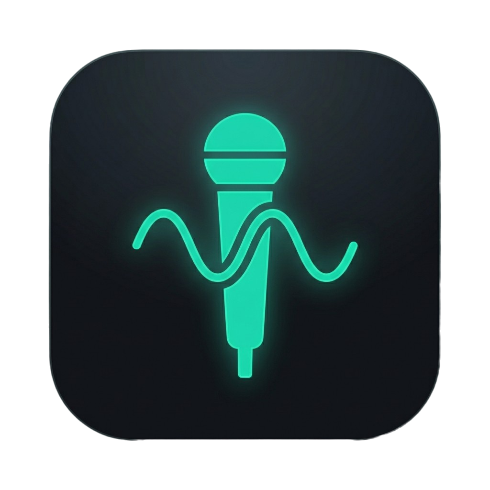
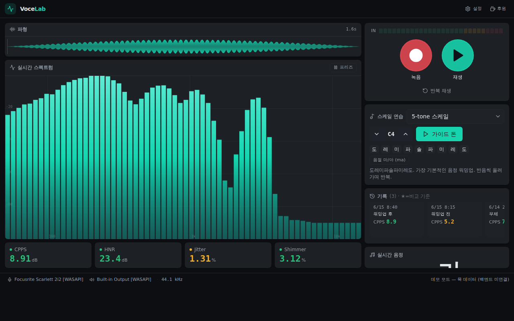
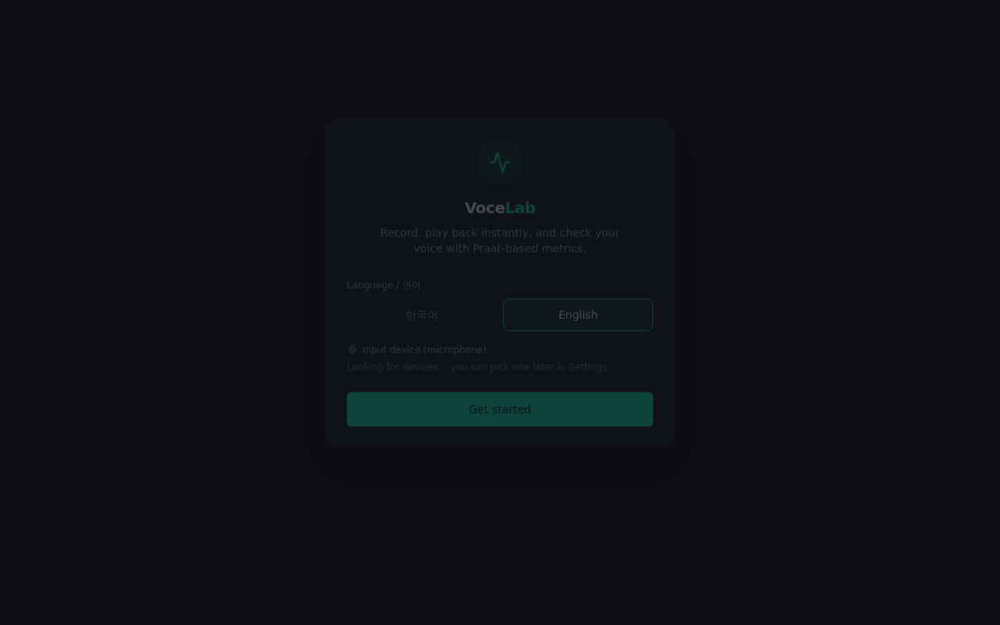

<div align="center">



# VoceLab

**내 목소리를 녹음하고, 멈추는 순간 바로 들어보고, 내 발성이 실제로 어떤지 눈으로 확인하세요.**

데스크톱 보컬 트레이닝 스튜디오. 오디오 인터페이스로 DAW처럼 녹음하고, 멈추자마자 곧바로 재생해 피드백하며, Praat 수준의 음향 지표로 발성을 분석합니다. 전부 오프라인 — 어떤 데이터도 기기 밖으로 나가지 않습니다.

[English](README.md) · [**한국어**](README.ko.md)

[](https://github.com/kedw0316/vocelab/releases/latest)
[](https://github.com/kedw0316/vocelab/releases/latest)
[](LICENSE)
[](https://kedw0316.github.io/VoceLab/)



</div>

---

## 왜 VoceLab인가 — 핵심 루프

보컬은 그래프로 늘지 않습니다. **자기 목소리를 듣고** 반응하면서 늡니다. 그래서 VoceLab은 단 하나의 짧은 루프를 중심으로 설계됐고, 나머지 기능은 전부 이 루프를 받쳐주기 위해 존재합니다:

> ### 🎙 녹음 → ▶️ 즉시 재생 → 👂 인지 → 🎚 교정 → 🔁 반복

녹음 버튼을 누르고, 노래하거나 말하고, 멈추면 — **멈추는 즉시 방금 녹음이 재생**되고, 원하면 반복재생됩니다. 좋은 보컬 코치가 방금 부른 프레이즈를 바로 다시 부르게 하듯, 근육 기억이 식기 전에 피드백이 도착합니다. 이어서 객관적인 지표가 귀로 느낀 것을 수치로 확인해 주죠. "방금 좀 바람 새는 느낌이었어"가 세션마다 추세를 볼 수 있는 숫자가 됩니다.

이 **녹음하고 바로 듣는** 순간이 이 앱의 전부입니다 — 곁다리 기능이 아니라요.

## 주요 기능

- 🎙 **녹음 & 즉시 재생** — 녹음을 멈추면 방금 녹음이 바로 재생됩니다. 파형 아무 곳이나 클릭하면 그 지점부터 재생되고, 반복재생으로 집중 연습도 가능합니다.
- 🔁 **피드백 반복재생 모드** — 멈추는 즉시 자동 반복되어, 기억 속 내 소리와 실제로 나온 소리를 바로 비교할 수 있습니다.
- 🎵 **실시간 음정** — 노트+옥타브와 센트를, 한국식 보컬 옥타브(`3옥 도`) 또는 과학적 음이름(`C4`)으로. 실시간 입력·재생·모니터 공통.
- 📊 **실시간 스펙트럼** — DAW EQ식 막대 분석기 + 프리즈.
- 🔬 **음향 지표** — Praat 엔진의 CPPS · HNR · 지터 · 쉬머, 양호 / 주의 / 개선 색으로 표시.
- 🎹 **스케일 연습** — 워밍업 스케일 17종 + 가이드 톤 + 키 트랜스포즈.
- 📈 **기록 & 전후 비교** — 녹음마다 로컬 자동 저장, 아무 녹음이나 비교 기준으로 두면 델타 표시.
- 🌐 **한국어 / English** — 첫 실행 때 언어 선택, 설정에서 언제든 변경.
- 🔒 **완전 로컬** — 녹음·기록은 내 디스크에만. 계정도, 업로드도 없습니다.

## 지표가 뜻하는 것

아래 네 가지는 연구로 검증된 음질 지표로, 임상에서 쓰는 것과 같은 Praat 엔진으로 계산됩니다:

| 지표 | 무엇을 재나 | 좋을 때 |
| --- | --- | --- |
| **CPPS** | 켑스트럼 피크 현저성 — 목소리의 전반적 명료도·주기성 (가장 robust한 단일 음질 지표) | **높을수록** (≥ 약 4 dB) |
| **HNR** | 배음 대 잡음 비 — 깨끗한지 vs 바람 새는지 | **높을수록** (≥ 약 20 dB) |
| **Jitter(지터)** | 주기 간 주파수 섭동 — 음정 안정성 | **낮을수록** (< 약 1%) |
| **Shimmer(쉬머)** | 주기 간 진폭 섭동 — 음량 안정성 | **낮을수록** (< 약 3.8%) |

근거와 기준값: [`docs/REFERENCES.md`](./docs/REFERENCES.md).

## 다운로드

[**Releases**](https://github.com/kedw0316/vocelab/releases/latest) 페이지에서 최신 설치 파일을 받으세요:

- **Windows** — `VoceLab-Setup.exe` → 실행하면 설치됩니다.
- **macOS** — `VoceLab.dmg` → 열어서 VoceLab을 Applications로 드래그하세요.

> macOS 빌드는 코드 서명이 없어 처음 열 때 차단될 수 있습니다. 앱을 **우클릭 → 열기**로 한 번 실행하면 그 다음부터는 정상적으로 열립니다.

<div align="center"></div>

## 소스에서 실행

사전 준비: **Python 3.11+**, **Node 18+**.

```bash
# 1) 웹 UI 빌드 (프론트엔드 변경 시마다)
cd frontend && npm install && npm run build && cd ..

# 2) 백엔드 설치 후 실행
python -m venv .venv
source .venv/bin/activate          # Windows: .venv\Scripts\Activate.ps1
pip install -e .
python -m vocelab
```

프론트엔드 단독 개발: `cd frontend && npm run dev` (백엔드 없으면 목 데이터로 동작).
디버그(개발자도구): `VOCELAB_DEBUG=1 python -m vocelab`.

```bash
# 테스트 (오디오 하드웨어 불필요)
pip install pytest && PYTHONPATH=src pytest
```

## 아키텍처

- **백엔드(Python)** — 오디오 I/O(`sounddevice` / PortAudio), 음향 분석(`praat-parselmouth`), 신호처리(`scipy` / `numpy`). UI에 비의존이라 엔진 단독으로 테스트 가능.
- **프론트엔드(웹)** — React + TypeScript + Tailwind. `pywebview`가 네이티브 창에 띄우고, `window.pywebview.api`로 백엔드를 호출.

```
src/vocelab/   # Python: audio / analysis / dsp / scales / synth / sessions / webapp
frontend/      # React 웹 UI (Vite), 한/영 i18n
packaging/     # PyInstaller(.spec) + Inno Setup(.iss) 설치파일
site/          # 랜딩 페이지(GitHub Pages)
docs/          # 지표 출처 · 발성 연습 레퍼런스
```

## 릴리스

`v*` 태그를 푸시하면 GitHub Actions가 Windows 설치 마법사와 macOS DMG를 빌드해 GitHub Release에 첨부합니다:

```bash
git tag v0.1.0 && git push origin v0.1.0
```

자세한 내용·서명 안내: [`packaging/README.md`](./packaging/README.md).

## 로드맵

- [ ] 세션 누적 VRP(음역 프로파일)
- [ ] Singer's Formant / SPR · 비브라토 지표를 lean UI에 노출
- [ ] 종합 점수(AVQI식)로 추세를 한 숫자로
- [ ] 서명/공증된 macOS 빌드

## 참고

VoceLab은 **의료·진단 도구가 아닙니다.** 음성 문제가 지속되면 전문가(이비인후과 / 언어재활사) 상담을 권합니다.

## 후원

VoceLab이 연습에 도움이 됐다면 [**Ko‑fi에서 커피 한 잔 ☕**](https://ko-fi.com/pongtuna) 사주셔도 좋아요. 전적으로 선택이고, 프로젝트를 계속 굴러가게 합니다.

## 라이선스

[MIT](./LICENSE)
