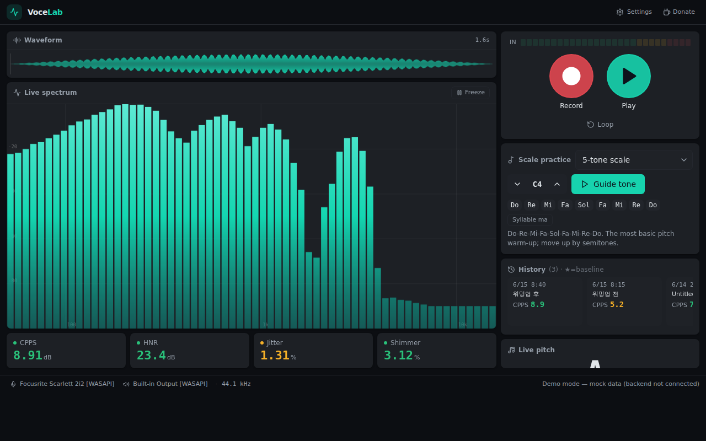

<div align="center">


# VoceLab

**Record your voice, hear it back the instant you stop, and see what your voice is actually doing.**

A desktop vocal‑training studio. Capture from your audio interface like a DAW, play the take back immediately for feedback, and read Praat‑grade acoustic metrics — all offline, nothing leaves your machine.

[**English**](README.md) · [한국어](README.ko.md)

[](https://github.com/kedw0316/vocelab/releases/latest)
[](https://github.com/kedw0316/vocelab/releases/latest)
[](LICENSE)
[](https://kedw0316.github.io/VoceLab/)



</div>

---

## Why VoceLab — the core loop

Singers don't improve from charts. They improve from **hearing themselves** and reacting. So VoceLab is built around one tight loop, and everything else exists to serve it:

> ### 🎙 Record → ▶️ Hear it back instantly → 👂 Notice → 🎚 Adjust → 🔁 Again

Hit record, sing or speak, hit stop — and **the take plays back the moment you stop**, optionally on a loop. The feedback lands while the muscle memory is still warm, the way a good vocal coach makes you sing a phrase right back. Then the objective metrics confirm what your ears just caught, so "that felt breathy" becomes a number you can watch trend over sessions.

That immediate **record‑then‑listen** moment is the whole point of the app — not an afterthought.

## Features

- 🎙 **Record & instant playback** — stop recording and the take plays right back; click anywhere on the waveform to replay from that point, or loop it for drilling.
- 🔁 **Feedback loop mode** — the take auto‑repeats the instant you stop, so you can compare your memory of it against what actually came out.
- 🎵 **Live pitch** — note + octave and cents, in either Korean vocal octave (`3옥 도`) or scientific notation (`C4`), for live input, playback, and monitoring.
- 📊 **Live spectrum** — a DAW‑style EQ bar analyzer with freeze.
- 🔬 **Acoustic metrics** — CPPS · HNR · Jitter · Shimmer from the Praat engine, color‑graded good / watch / needs‑work.
- 🎹 **Scale practice** — 17 warm‑up scales with guide tones and key transposition.
- 📈 **History & before/after** — every take is saved locally; set any take as a baseline to see the delta.
- 🌐 **Korean / English** — pick your language on first launch, switch anytime in Settings.
- 🔒 **Fully local** — recordings and history stay on your disk. No account, no upload.

## What the metrics mean

These four are research‑backed measures of voice quality, computed with the same Praat engine clinicians use:

| Metric | What it measures | Better when |
| --- | --- | --- |
| **CPPS** | Cepstral Peak Prominence — overall clarity & periodicity of the voice (the most robust single quality measure) | **higher** (≥ ~4 dB) |
| **HNR** | Harmonics‑to‑noise ratio — how clean vs. breathy the tone is | **higher** (≥ ~20 dB) |
| **Jitter** | cycle‑to‑cycle frequency perturbation — pitch steadiness | **lower** (< ~1%) |
| **Shimmer** | cycle‑to‑cycle amplitude perturbation — loudness steadiness | **lower** (< ~3.8%) |

Sources and thresholds: [`docs/REFERENCES.md`](./docs/REFERENCES.md).

## Download

Grab the latest installer from the [**Releases**](https://github.com/kedw0316/vocelab/releases/latest) page:

- **Windows** — `VoceLab-Setup.exe` → run it to install.
- **macOS** — `VoceLab.dmg` → open and drag VoceLab into Applications.

> macOS builds are unsigned, so the first launch may be blocked. Right‑click the app → **Open** to run it once; after that it opens normally.

<div align="center"></div>

## Run from source

Prerequisites: **Python 3.11+**, **Node 18+**.

```bash
# 1) Build the web UI (rebuild whenever the frontend changes)
cd frontend && npm install && npm run build && cd ..

# 2) Install the backend and launch
python -m venv .venv
source .venv/bin/activate          # Windows: .venv\Scripts\Activate.ps1
pip install -e .
python -m vocelab
```

Frontend‑only dev: `cd frontend && npm run dev` (runs on mock data without a backend).
Open devtools: `VOCELAB_DEBUG=1 python -m vocelab`.

```bash
# Tests (no audio hardware needed)
pip install pytest && PYTHONPATH=src pytest
```

## Architecture

- **Backend (Python)** — audio I/O (`sounddevice` / PortAudio), acoustic analysis (`praat-parselmouth`), signal processing (`scipy` / `numpy`). UI‑agnostic, so the engine is unit‑testable on its own.
- **Frontend (web)** — React + TypeScript + Tailwind, hosted in a native window by `pywebview`; it talks to the backend over `window.pywebview.api`.

```
src/vocelab/   # Python: audio / analysis / dsp / scales / synth / sessions / webapp
frontend/      # React web UI (Vite) with KO/EN i18n
packaging/     # PyInstaller (.spec) + Inno Setup (.iss) installer
site/          # Landing page (GitHub Pages)
docs/          # Metric sources & vocal-exercise references
```

## Releases

Pushing a `v*` tag builds the Windows installer and the macOS DMG via GitHub Actions and attaches them to a GitHub Release:

```bash
git tag v0.1.0 && git push origin v0.1.0
```

Details and signing notes: [`packaging/README.md`](./packaging/README.md).

## Roadmap

- [ ] Voice Range Profile (VRP) accumulation across sessions
- [ ] Singer's Formant / SPR and vibrato readouts in the lean UI
- [ ] Composite score (AVQI‑style) to track one number over time
- [ ] Signed / notarized macOS build

## Note

VoceLab is **not a medical or diagnostic device**. If a voice problem persists, please see a specialist (ENT / speech‑language pathologist).

## Support

If VoceLab helps your practice, you can [**buy me a coffee on Ko‑fi ☕**](https://ko-fi.com/pongtuna). Totally optional — it keeps the project moving.

## License

[MIT](./LICENSE)
